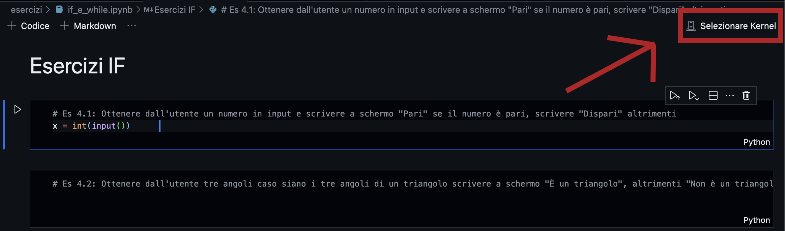
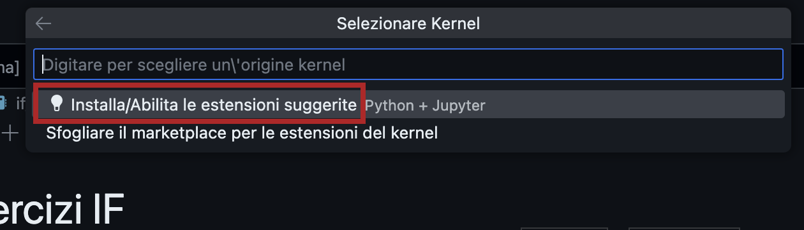
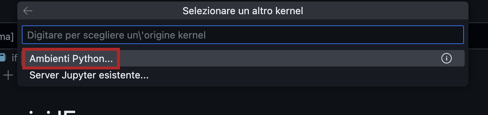
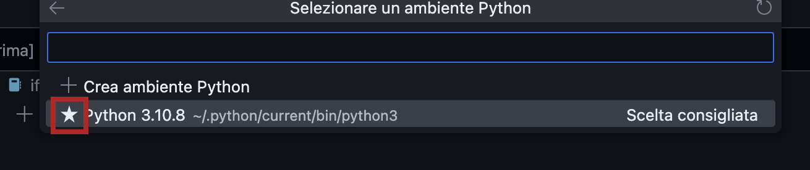
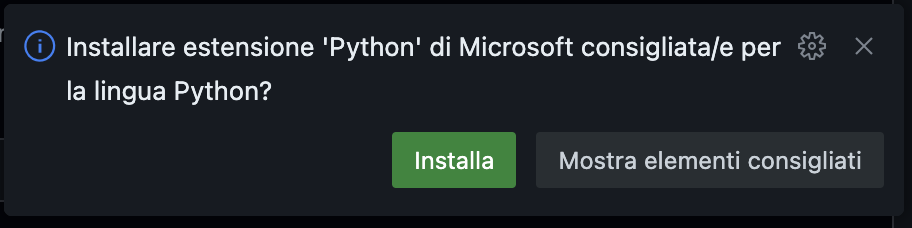

# Introduzione
Questa repository contiene tutto quello che ci può servire quest'anno

# Documentazione
Per la documentazione su Python vai al link [Documentazione divertente su Python](https://colab.research.google.com/github/SamueleLonghin/teach-py/blob/tlc-2023-24/presentazione_python.ipynb) (da aprire su un account non della scuola... per il momento la nostra scuola non vuole che usiamo questo strumento ma ci sto lavorando)

In alternativa anche questa repository contiene la [documentazione divertente](teoria/presentazione_python.ipynb).

Per  qualunque dubbio chiedete pure a me o più semplicemente **googlate** quello di cui avete bisogno, StackOverflow, GitHub, W3School sono delle ottime fonti generalmente (se le usate bene). Non sono le uniche ovviamente, abbiate fantasia nel cercare i vostri problemi!!

# Configurazione
La prima volta sarà necessaria una parte di configurazione dello spazio di lavoro. Segui i passaggi elencati qui sotto:
* Aprire un file notebook (file terminati con l'estensione `.ipynb`)
* Clicca in alto a destra sul pulsante `Seleziona Kernel` come mostrato in figura
* A questo punto apparirà un menù con delle voci, tra queste scegliere `Installa/Abilita le estensioni suggerite`
* Al termine di questa operazione lo stesso menù vi chiederà di Selezionare il Kernel, scegliere `Ambienti Python` 
* Ora chiederà quale ambiente Python utilizzare `Python 3.10.8` o qualunque altra versione vi suggerisca preceduta da una stellina 

Ora il nostro ambiente è pronto per essere utilizzato!!!
Potrebbe comparirvi un popup in basso a destra chiedendovi se installare delle estensioni suggerite, voi dite pure di si cliccando su `Installa`

# Utilizzo
Gli esercizi verranno caricati all'interno della cartella `esercizi-base`. Per svolgerli seguire i seguenti passaggi:
* Copiare o spostare il file desiderato all'internod ella cartella `esercizi`
* Svolgere i quesiti richiesti all'interno del blocco
* Runnare il blocco cliccando sul pulsantino ▶️ sulla sinistra del blocco.